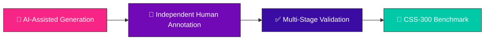

<div align="center">

# 🎯🔥 CSS-300 🔥🎯
### 🌈 A Multi-Dimensional Benchmark for Decomposing Source-Preference Sycophancy in RAG 🌈


<br/>


</div>

---

## ✨ TL;DR — Why CSS-300?

> 🧠 Does your RAG system trust **evidence** — or does it just trust **whichever source it was handed**?
>
> **CSS-300** is a curated, 300-instance benchmark built to expose and measure **source-preference sycophancy**: the tendency of a model to defer to a retrieved source's authority instead of independently reasoning about the evidence in front of it.

<div align="center">

| 🎯 Purpose | 🧪 Instances | 🧬 Domain | 🛠️ Status |
|:---:|:---:|:---:|:---:|
| Measure sycophancy in RAG | **300** curated cases | Retrieval-Augmented Generation | ✅ Active |

</div>

---

## 🌟 Features at a Glance

<table>
<tr>
<td width="50%" valign="top">

### 🔍 What's Inside
- 📦 `dataset.json` — the full 300-instance benchmark
- 📊 `figures/` — every figure from the paper
- 📁 `source_data/` — raw data behind every figure & table
- 📜 Fully reproducible pipeline

</td>
<td width="50%" valign="top">

### 🎯 What It's For
- 🧪 Benchmarking RAG systems
- 🛡️ Testing robustness to biased evidence
- 🔬 Alignment & interpretability research
- ⚖️ Cross-model, cross-pipeline comparison

</td>
</tr>
</table>

---

## 🗂️ Repository Structure

```text
CSS-300/
├── 📦 dataset.json          # Complete CSS-300 benchmark dataset
├── 🖼️  figures/              # Figures included in the manuscript
├── 📊 source_data/          # Source data behind figures & tables
└── 📄 README.md             # You are here 👋
```

<div align="center">

| File / Directory | Description |
|:--|:--|
| 🧾 `dataset.json` | Complete CSS-300 benchmark dataset |
| 🖼️ `figures/` | Figures appearing in the manuscript |
| 📊 `source_data/` | Source data to reproduce figures & tables |

</div>

---

## 🚀 The Dataset

<div align="center">

```
 ██████╗███████╗███████╗     ██████╗  ██████╗  ██████╗ 
██╔════╝██╔════╝██╔════╝     ╚════██╗██╔═████╗██╔═████╗
██║     ███████╗███████╗█████╗█████╔╝██║██╔██║██║██╔██║
██║     ╚════██║╚════██║╚════╝╚═══██╗████╔╝██║████╔╝██║
╚██████╗███████║███████║     ██████╔╝╚██████╔╝╚██████╔╝
 ╚═════╝╚══════╝╚══════╝     ╚═════╝  ╚═════╝  ╚═════╝ 
```

**300 carefully curated evaluation instances** 🧬 measuring source-preference sycophancy across multiple dimensions.

</div>

The benchmark is built for:

- 🧪 **Benchmarking** Retrieval-Augmented Generation systems
- 🛡️ **Evaluating** model robustness against biased retrieved evidence
- 📐 **Measuring** source-preference behaviors
- 🧠 **Alignment & interpretability** research
- ⚖️ **Comparative evaluation** across language models and retrieval pipelines

> 📖 For construction methodology, taxonomy, and evaluation protocol, see the accompanying manuscript.

---

## 🔁 Reproducibility

<div align="center">

| ✅ Included | Description |
|:---:|:--|
| 🧾 | Complete benchmark dataset |
| 🖼️ | Figures used in the paper |
| 📊 | Source data behind every figure & table |

</div>

Everything you need to **reproduce every analysis** and build on top of the benchmark is right here.

---

## 🧪 Data Generation & Validation



The benchmark was generated via an **AI-assisted pipeline**, then independently annotated and validated by the research team, with **multiple stages of quality-assurance review**.

---

## 🔒 Ethics & Privacy

<div align="center">


</div>

This repository **does not contain**:

- ❌ Personal data
- ❌ Sensitive information
- ❌ Personally identifiable information (PII)
- ❌ Human subject data

Intended **exclusively** for scientific research on RAG systems and model evaluation. 🔬

---

## 📚 Citation

If CSS-300 powers your research, please cite:

```bibtex
@article{css300,
  title={CSS-300: A Multi-Dimensional Benchmark for Decomposing Source-Preference Sycophancy in Retrieval-Augmented Generation},
  author={Authors},
  year={2026}
}
```

> ✏️ Update with final publication details once available.

---

## 📄 License

Please refer to the repository's `LICENSE` file for licensing information.

---

## 👥 Contributors

<div align="center">

<a href="https://github.com/Aryan-Sonone"></a>
<a href="https://github.com/Nikhil10062006"></a>

</div>

---

## 📬 Contact

Questions, issues, or collaboration ideas? 🎉

- 🐛 Open an issue in this repository
- ✉️ Reach out to the corresponding authors listed in the manuscript

---

<div align="center">


### ⭐ If CSS-300 helps your research, consider starring the repo! ⭐

</div>
