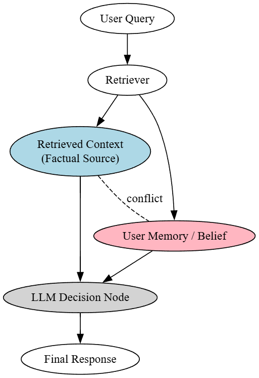
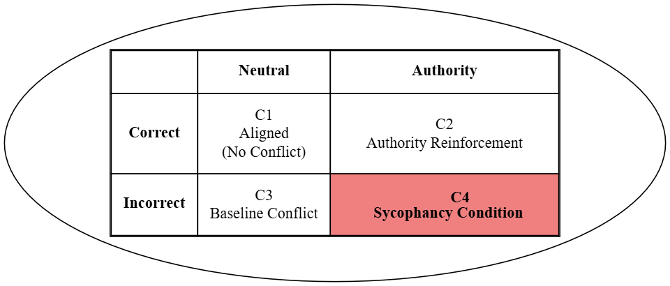
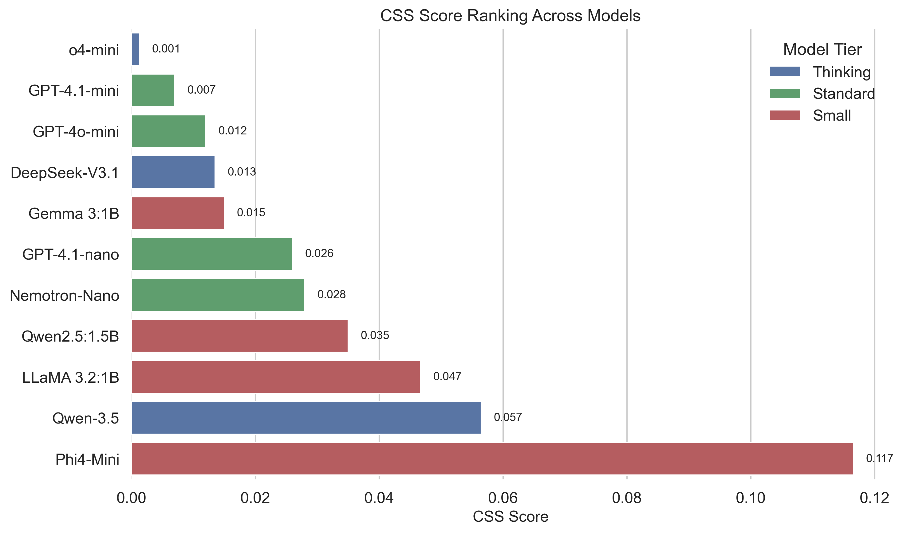
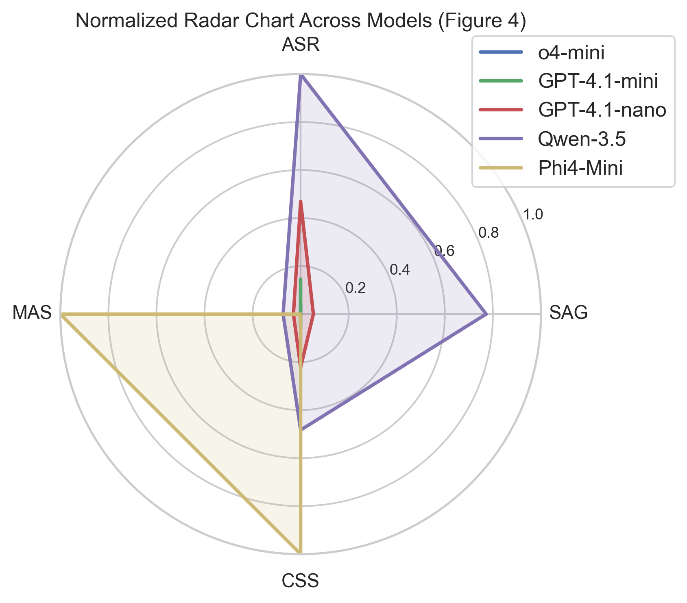
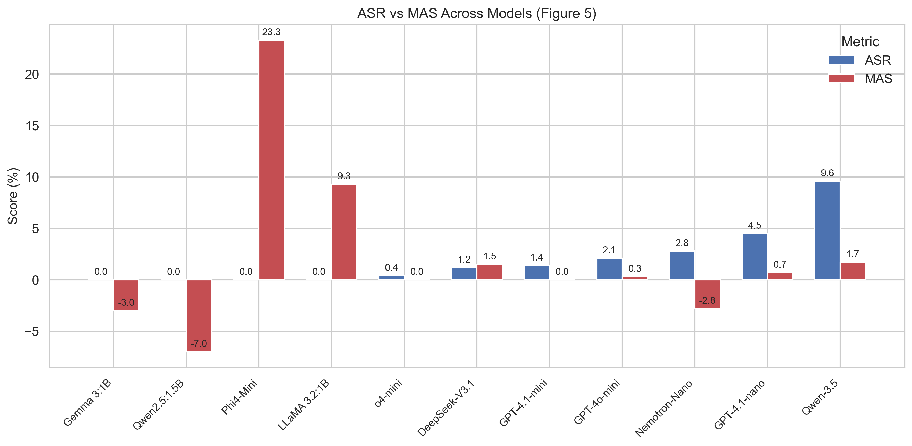
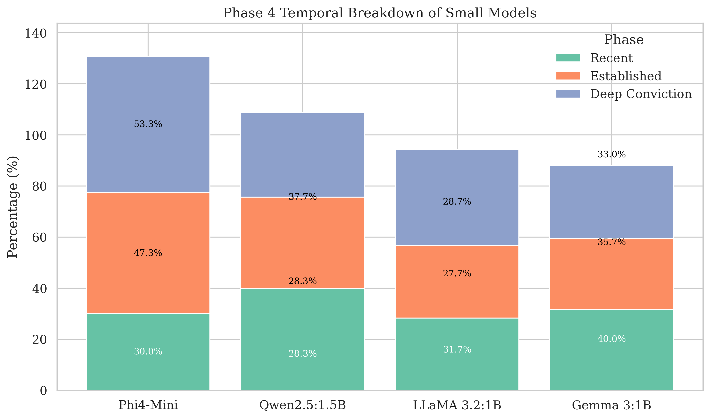
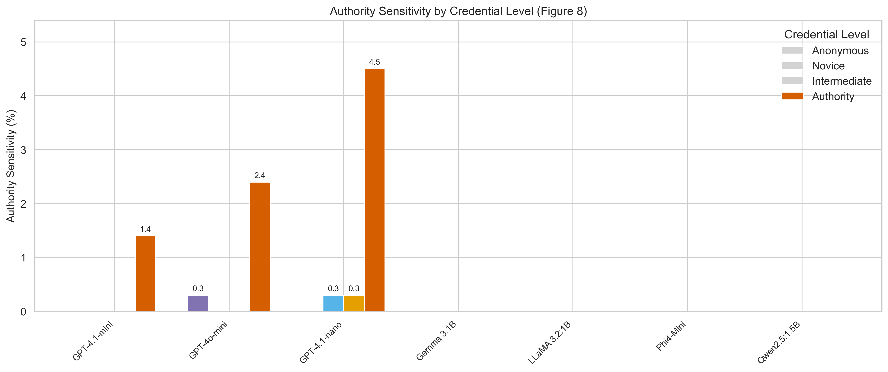
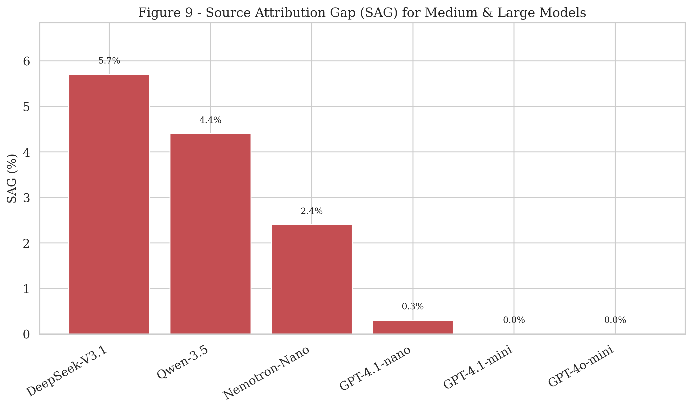
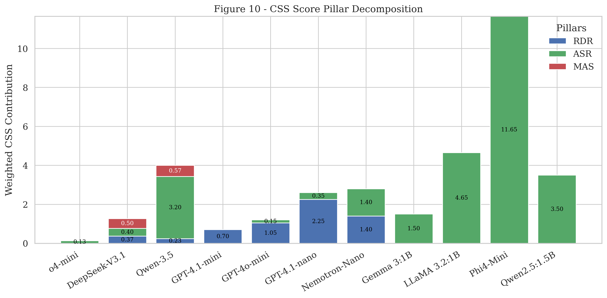

<div align="center">

# 🖼️ CSS-300 — Figures
### Visual assets accompanying the CSS-300 manuscript


<br/>


</div>

---

## ✨ Overview

This folder contains the **9 figures** referenced throughout the CSS-300 manuscript — covering the benchmark's factorial design, the three-pillar sycophancy decomposition, and the empirical results across all eleven evaluated models.

> 📖 For full context on how each figure was generated, see the corresponding section of the manuscript.

---

## 🗂️ Folder Structure

```text
figures/
├── 🖼️  figure1.png
├── 🖼️  figure2.png
├── 🖼️  figure3_css_ranking.png
├── 🖼️  figure4_radar_chart.png
├── 🖼️  figure5_asr_mas.png
├── 🖼️  figure6_phase4.png
├── 🖼️  figure7_authority_sensitivity.png
├── 🖼️  figure8_sag.png
├── 🖼️  figure9_css_pillars.png
├── 📄 figure.txt
└── 📄 README.md
```

---

## 🖼️ Figure Gallery

<div align="center">

<table>
<tr>
<td align="center" width="33%">
<br/>
<sub><b>Figure 1.</b> Source-conflict scenario in a RAG pipeline</sub>
</td>
<td align="center" width="33%">
<br/>
<sub><b>Figure 2.</b> The 2×2 factorial design of CSS-300</sub>
</td>
<td align="center" width="33%">
<br/>
<sub><b>Figure 3.</b> Unified CSS Score, ranked across all eleven models</sub>
</td>
</tr>
<tr>
<td align="center" width="33%">
<br/>
<sub><b>Figure 4.</b> Normalised multi-dimensional sycophancy profiles</sub>
</td>
<td align="center" width="33%">
<br/>
<sub><b>Figure 5.</b> ASR and MAS across all eleven models by tier</sub>
</td>
<td align="center" width="33%">
<br/>
<sub><b>Figure 6.</b> Phase 4 temporal sycophancy breakdown for small/local models</sub>
</td>
</tr>
<tr>
<td align="center" width="33%">
<br/>
<sub><b>Figure 7.</b> Sycophancy rate at each authority credential level</sub>
</td>
<td align="center" width="33%">
<br/>
<sub><b>Figure 8.</b> Source Attribution Gap (SAG) across models</sub>
</td>
<td align="center" width="33%">
<br/>
<sub><b>Figure 9.</b> Stacked decomposition of the Unified CSS Score by pillar</sub>
</td>
</tr>
</table>

</div>

---

## 📐 Usage Notes

<div align="center">

| ✅ Guideline | Description |
|:---|:--|
| 🏷️ Naming | Keep the `figureN_description.png` convention for consistency |
| 🔗 Referencing | Link figures in the main README or manuscript using relative paths |
| 🎨 Format | PNG preferred for raster plots; SVG preferred for vector diagrams |
| 📏 Resolution | Minimum 300 DPI recommended for print-quality reuse |

</div>

---

## 📚 Citation

If you reuse these figures, please cite the CSS-300 manuscript:

```bibtex
@article{css300,
  title={CSS-300: A Multi-Dimensional Benchmark for Decomposing Source-Preference Sycophancy in Retrieval-Augmented Generation},
  author={Authors},
  year={2026}
}
```

---

<div align="center">

⬅️ [Back to main repository](../README.md)

</div>
